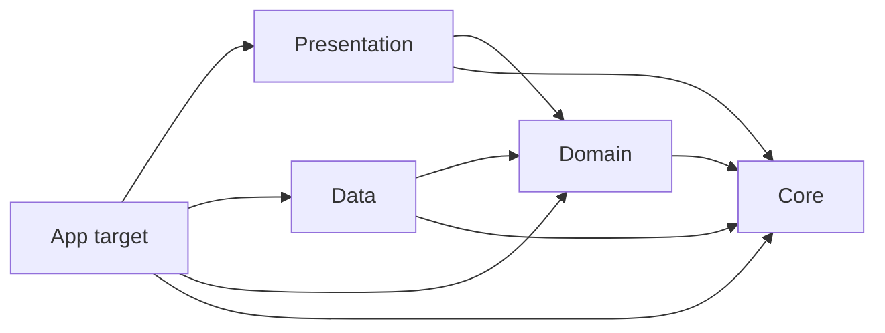

# Castle — Subscription Expense Tracker

[](https://github.com/obadasemary/Castle/actions/workflows/ci.yml)

A native iOS app for tracking personal subscriptions: total monthly spend, upcoming renewals, category breakdowns, and trends — all local-first via SwiftData.

## Features

- **Dashboard** — total monthly spend with a 6-month trend, budget progress, upcoming renewals carousel, and recent activity.
- **Subscriptions** — active and archived lists, add from a popular-services grid or custom form, edit detail, swipe to archive or delete.
- **Analytics** — donut chart by category, monthly trend bars, category breakdown, and a hand-coded insight line.
- **Settings** — profile, currency, appearance, monthly budget, and notification preferences with authorization-aware UI.

## Architecture

Clean Architecture across four local SPM packages, with the dependency direction enforced by SPM:



| Package | Responsibility |
|---|---|
| `Core` | `Money`, `BillingCycleCalculator`, `Clock`, `CalendarProvider`. No app-specific types. |
| `Domain` | Pure value types (`Subscription`, `PaymentRecord`, `UserProfile`, …), repository protocols, use cases. No frameworks. |
| `Data` | SwiftData `@Model` types, versioned `Schema`, `ModelActor` repositories, mappers, and `UNUserNotification*` adapters. |
| `Presentation` | `@Observable @MainActor` view models, SwiftUI views, design system tokens, and an `AppCoordinator` covering all router protocols. |

Boundary rules:

- `Presentation` never imports `Data`; everything flows through Domain protocols.
- Repositories are `ModelActor`s; SwiftData `@Model` instances never escape the actor — mappers snapshot to value types inside.
- Use cases inject `Clock` and `CalendarProvider`; no use case calls `Date()` directly.
- Each feature owns a small `*ViewModelFactory` protocol; the app's `AppDependencyContainer` conforms and is published through SwiftUI environment.

## Layout

```
Castle/
├── Castle.xcworkspace/         ← open this
├── Castle.xcodeproj/
├── Castle/                     ← @main, DI, environment
│   ├── App/
│   ├── DI/
│   └── Resources/
├── CastleUITests/
└── Packages/
    ├── Core/
    ├── Domain/
    ├── Data/
    └── Presentation/
```

## Stack

- Swift 6 with strict concurrency
- SwiftUI + `@Observable`
- SwiftData (versioned schema)
- Apple Charts (donut + bars)
- UserNotifications (local reminders, with authorization-aware UI)
- Swift Testing for package tests; XCTest for UI smoke

## Getting started

Requires Xcode 26 and the iOS 26 SDK.

```bash
open Castle.xcworkspace
```

Pick the `Castle` scheme and run on an iOS 26 simulator. The first launch creates an empty SwiftData store; tap **+** in the Subscriptions tab to add one (Netflix, Spotify, and other popular services ship as catalog entries).

## Build & test from CLI

```bash
# Build the app target
xcodebuild \
  -workspace Castle.xcworkspace \
  -scheme Castle \
  -destination "generic/platform=iOS" \
  -skipPackagePluginValidation \
  CODE_SIGNING_ALLOWED=NO \
  clean build

# Per-package logic tests (no simulator)
(cd Packages/Core && swift test --parallel)
(cd Packages/Domain && swift test --parallel)
(cd Packages/Data && swift test --parallel)
(cd Packages/Presentation && swift test --parallel)

# UI smoke (simulator)
xcodebuild \
  -workspace Castle.xcworkspace \
  -scheme Castle \
  -destination 'platform=iOS Simulator,name=iPhone 16' \
  test
```

## CI

GitHub Actions runs on every push to `main`, `feature/*`, `claude/*`, and on PRs to `main`:

- **Build iOS app** — `xcodebuild generic/platform=iOS` to confirm the workspace + all packages still link.
- **Test Core / Domain / Data / Presentation** — `swift test --parallel` per package, in a matrix.
- **GitGuardian** — secret scan on diffs.

The matrix intentionally skips simulator-based UI tests; those are run locally before merge.

## Out of scope (v1)

- macOS and visionOS targets.
- Cross-currency FX conversion (each subscription stores its own currency).
- Automated price-increase detection.
- Family Sharing tracker and Trial Management screens.
- AI-generated insight text (a single hand-coded heuristic ships in v1).
- Live appearance flip — the picker persists the preference; applying it app-wide is a follow-up.
